# Workflow — Brand System da Overlens

## Sistema de Produção de Páginas

> Este documento descreve o processo completo para criar, revisar e validar cada página faltante do Livro de Branding da Overlens. O sistema foi desenhado para garantir que toda nova página seja indistinguível das já escritas — mesmo tom, mesma profundidade, mesma visão.

---

## Visão Geral

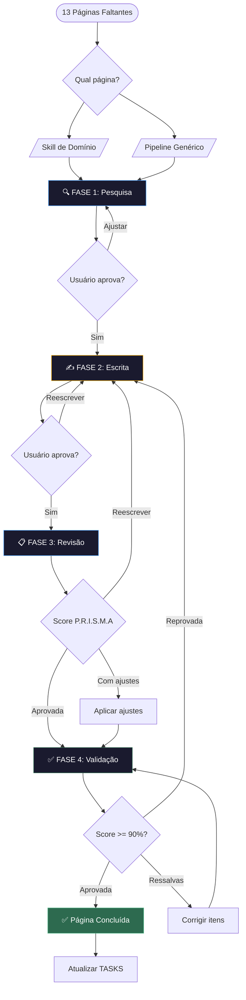

---

## As 4 Fases

### Fase 1 — Pesquisa (`/pesquisar`)

```mermaid
flowchart LR
    subgraph ENTRADA
        RAG[RAG_OVERLENS_COMPLETO.md]
        DOC[Documento Central]
        TASKS[TASKS_PAGINAS_FALTANTES.md]
    end

    subgraph AGENTE["🔍 Agente: pesquisador"]
        direction TB
        C[Conexões com doc central]
        O[Objetivo da página]
        N[Narrativa — onde se insere]
        T[Tom — mix das 4 virtudes]
        E[Estrutura — modelo similar]
        X[Exemplos e dados existentes]
        T2[Território — vocabulário]
        OUT[Output esperado]
    end

    subgraph SAIDA
        BRIEFING["[PESQUISA] Página.md"]
    end

    ENTRADA --> AGENTE
    AGENTE --> SAIDA

    style AGENTE fill:#1a1a2e,stroke:#4a9eff,color:#fff
```

**Agente**: `pesquisador`
**Framework**: C.O.N.T.E.X.T.O
**Input**: RAG + Documento Central + TASKS
**Output**: `[PESQUISA] Nome da Página.md`

**O que faz**:
- Lê o RAG completo para contexto
- Busca seções conectadas no documento central (com número de linha)
- Identifica a página mais similar já escrita (modelo de tom/estrutura)
- Pesquisa referências externas de branding quando relevante
- Mapeia vocabulário obrigatório
- Produz briefing estruturado

---

### Fase 2 — Escrita (`/escrever`)

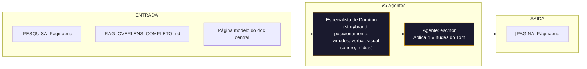

**Agentes**: `especialista-*` (domínio) + `escritor` (processo)
**Framework**: 4 Virtudes (Científica, Profunda, Provocativa, Inspiradora)
**Input**: Briefing de pesquisa + RAG + Página modelo
**Output**: `[PAGINA] Nome da Página.md`

**O que faz**:
- O especialista de domínio traz repertório teórico profundo (frameworks mundiais)
- O escritor garante que o output siga o padrão exato do Brand System
- Aplica vocabulário oficial, naming, metáforas do universo Overlens
- Verifica guardrails éticos antes de finalizar

---

### Fase 3 — Revisão (`/revisar`)

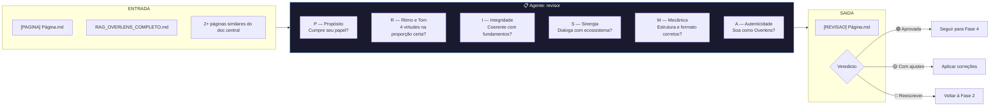

**Agente**: `revisor`
**Framework**: P.R.I.S.M.A
**Input**: Página escrita + RAG + Páginas de comparação
**Output**: `[REVISAO] Nome da Página.md`

**Critérios por dimensão**:

| Dimensão | Pergunta-chave | Prioridade |
|----------|---------------|------------|
| **P**ropósito | A página cumpre seu papel no Brand System? | 6 |
| **R**itmo e Tom | As 4 virtudes estão na proporção certa? | 3 |
| **I**ntegridade | Coerente com fundamentos da Overlens? | 1 |
| **S**inergia | Dialoga com ecossistema existente? | 4 |
| **M**ecânica | Estrutura, formato, português corretos? | 5 |
| **A**utenticidade | Soa como Overlens ou genérico? | 2 |

**Classificação**: Verde (alinhado) / Amarelo (ajustes) / Vermelho (reescrita)

---

### Fase 4 — Validação (`/validar`)

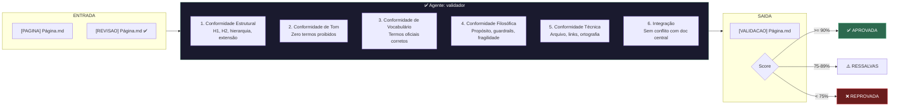

**Agente**: `validador`
**Framework**: Checklist binário 6 categorias
**Input**: Página escrita + Revisão aprovada
**Output**: `[VALIDACAO] Nome da Página.md`

**Critérios de aprovação**:
- **✅ APROVADA**: Score >= 90% e zero itens filosóficos reprovados
- **⚠️ RESSALVAS**: Score >= 75% e filosofia OK
- **❌ REPROVADA**: Score < 75% OU qualquer item filosófico reprovado

---

## Mapa de Agentes

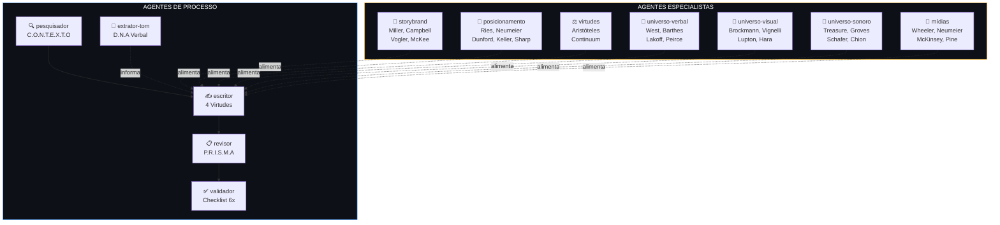

---

## Mapa de Skills

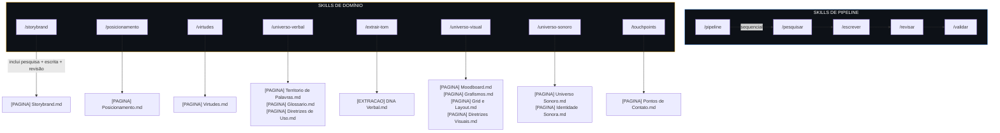

---

## Mapa de Páginas × Skills × Agentes

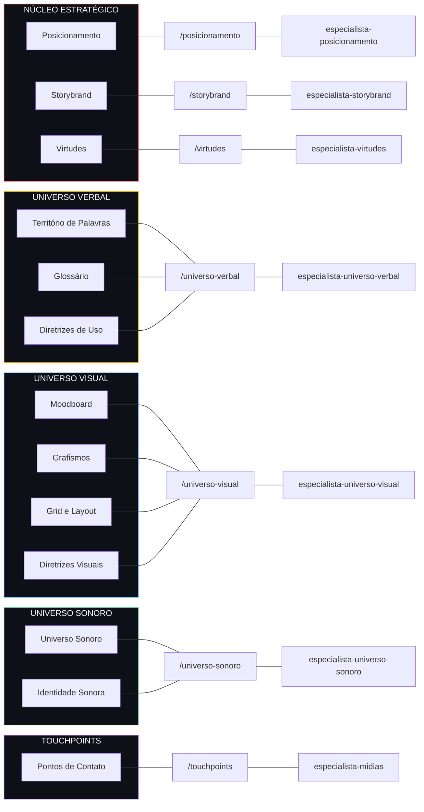

---

## Ordem de Execução Recomendada

```mermaid
gantt
    title Ordem de Produção das Páginas
    dateFormat X
    axisFormat %s

    section Núcleo Estratégico
    /extrair-tom (DNA Verbal)           :ext, 0, 1
    /posicionamento                      :pos, 1, 2
    /storybrand                          :sb, 2, 3
    /virtudes                            :vir, 3, 4

    section Universo Verbal
    /universo-verbal territorio          :ter, 4, 5
    /universo-verbal glossario           :glo, 5, 6
    /universo-verbal diretrizes          :dir, 6, 7

    section Universo Visual
    /universo-visual moodboard           :mood, 7, 8
    /universo-visual grid                :grid, 8, 9
    /universo-visual grafismos           :graf, 9, 10
    /universo-visual diretrizes          :dvis, 10, 11

    section Universo Sonoro
    /universo-sonoro visao               :son1, 11, 12
    /universo-sonoro identidade          :son2, 12, 13

    section Touchpoints
    /touchpoints                         :tp, 13, 14
```

**Lógica da ordem**:

1. **Extrair tom primeiro** — O DNA verbal real alimenta todas as outras páginas
2. **Posicionamento** — Ancora todo o restante (quem somos, para quem, por que diferentes)
3. **Storybrand** — Estrutura narrativa que alimenta conteúdo e comunicação
4. **Virtudes** — Sistema de comportamento que orienta decisões em todas as áreas
5. **Universo Verbal** — Base linguística para tudo que será escrito
6. **Universo Visual** — Sistema visual completo
7. **Universo Sonoro** — Dimensão sensorial complementar
8. **Touchpoints** — Aplicação de tudo nos canais reais (precisa de tudo anterior)

---

## Ciclo de Vida de uma Página

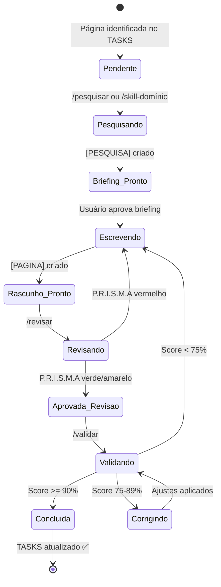

---

## Arquivos Gerados por Página

Cada página produz até 4 arquivos no ciclo completo:

```
📁 branding/
├── [PESQUISA] Nome da Página.md    ← Briefing (Fase 1)
├── [PAGINA] Nome da Página.md      ← Página final (Fase 2)
├── [REVISAO] Nome da Página.md     ← Relatório de revisão (Fase 3)
└── [VALIDACAO] Nome da Página.md   ← Relatório de validação (Fase 4)
```

Arquivo especial (gerado uma vez, alimenta todas as páginas):
```
├── [EXTRACAO] DNA Verbal da Overlens.md   ← Output do /extrair-tom
```

---

## Frameworks Proprietários

### C.O.N.T.E.X.T.O (Pesquisa)

| Letra | Dimensão | Pergunta |
|-------|----------|----------|
| **C** | Conexões | Quais seções do doc central se conectam? |
| **O** | Objetivo | Qual o propósito desta página no Brand System? |
| **N** | Narrativa | Como se insere na narrativa maior? |
| **T** | Tom | Qual mix das 4 virtudes predomina? |
| **E** | Estrutura | Qual página similar serve de modelo? |
| **X** | Exemplos | Que dados/citações existentes incluir? |
| **T** | Território | Quais termos do vocabulário oficial usar? |
| **O** | Output | Formato e extensão esperados? |

### P.R.I.S.M.A (Revisão)

| Letra | Dimensão | Prioridade |
|-------|----------|------------|
| **P** | Propósito | 6 |
| **R** | Ritmo e Tom | 3 |
| **I** | Integridade Conceitual | 1 (máxima) |
| **S** | Sinergia com Ecossistema | 4 |
| **M** | Mecânica e Formato | 5 |
| **A** | Autenticidade | 2 |

### D.N.A Verbal (Extração de Tom)

| Letra | Dimensão | O que analisa |
|-------|----------|---------------|
| **D** | Dicionário Ativo | Palavras frequentes, expressões, padrões sintáticos, ausências |
| **N** | Narrativa e Ritmo | Comprimento de frases, estrutura, figuras de linguagem, cadência |
| **A** | Atitude e Postura | Registro, voz narrativa, intensidade, relação com leitor |

---

## Referências Teóricas por Domínio

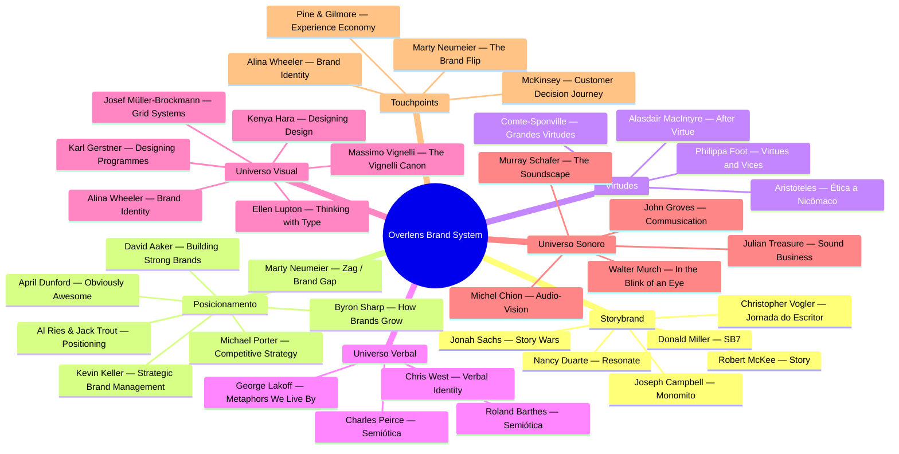

---

## Como Usar na Prática

### Opção 1: Página por página (recomendado)
```
Usuário: /posicionamento
→ Especialista pesquisa + escreve + revisão automática
→ Usuário revisa e aprova
→ /validar Posicionamento
→ ✅ Concluída
```

### Opção 2: Pipeline genérico
```
Usuário: /pipeline Moodboard
→ Fase 1: Pesquisa (aguarda aprovação)
→ Fase 2: Escrita (aguarda aprovação)
→ Fase 3: Revisão (automática)
→ Fase 4: Validação (resultado final)
→ ✅ Concluída
```

### Opção 3: Fase por fase (controle total)
```
Usuário: /pesquisar Moodboard
(revisa briefing, ajusta se necessário)
Usuário: /escrever Moodboard
(revisa rascunho, ajusta se necessário)
Usuário: /revisar Moodboard
(analisa score P.R.I.S.M.A)
Usuário: /validar Moodboard
→ ✅ Concluída
```

### Antes de tudo: extrair o DNA
```
Usuário: /extrair-tom
→ Produz [EXTRACAO] DNA Verbal da Overlens.md
→ Alimenta TODAS as escritas seguintes
```

---

## Progresso

| # | Página | Bloco | Skill | Status |
|---|--------|-------|-------|--------|
| 1 | Posicionamento | Estratégico | `/posicionamento` | ✅ |
| 2 | Storybrand | Estratégico | `/storybrand` | ✅ |
| 3 | Virtudes | Estratégico | `/virtudes` | ✅ |
| 4 | Território de Palavras | Verbal | `/universo-verbal` | ✅ |
| 5 | Glossário | Verbal | `/universo-verbal` | ✅ |
| 6 | Diretrizes de Uso | Verbal | `/universo-verbal` | ✅ |
| 7 | Moodboard | Visual | `/universo-visual` | ✅ |
| 8 | Grafismos | Visual | `/universo-visual` | ✅ |
| 9 | Grid e Layout | Visual | `/universo-visual` | ✅ |
| 10 | Diretrizes Visuais | Visual | `/universo-visual` | ✅ |
| 11 | Universo Sonoro | Sonoro | `/universo-sonoro` | ✅ |
| 12 | Identidade Sonora | Sonoro | `/universo-sonoro` | ✅ |
| 13 | Pontos de Contato | Touchpoints | `/touchpoints` | ✅ |

**Legenda**: ⬜ Pendente · 🔄 Em andamento · ✅ Concluída
